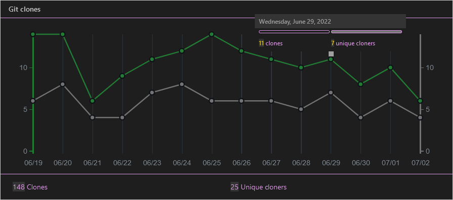
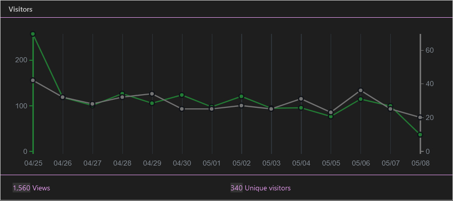
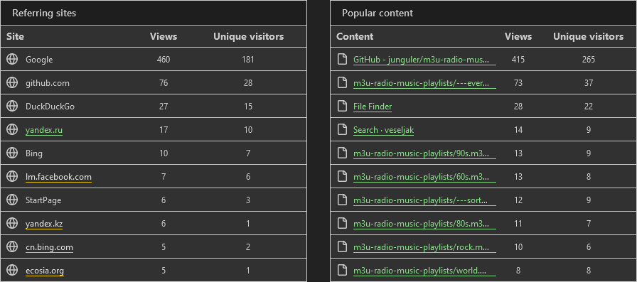

## Collection of m3u Radio Playlists, Updated daily (manually)
this repo now has a [github page](https://junguler.github.io/m3u-radio-music-playlists/), it's a simple tree view of all the raw files in the repo, it saves you the hassle of clicking the raw files or downloading them manually if you are only interested in a few of the streams, if you want all of the files, cloning the repo is still the better option which i explained about further down in this markdown file

### Shortcuts
 * [How to listen](https://github.com/junguler/m3u-radio-music-playlists#how-to-listen-to-these)
 * [How to download a stream](https://github.com/junguler/m3u-radio-music-playlists#how-to-download-a-live-stream-to-my-computer)
 * [Audio visualization](https://github.com/junguler/m3u-radio-music-playlists#mpv-only-shows-a-black-window-when-listening-to-music-how-to-make-it-pretty)
 * [Normilizing audio](https://github.com/junguler/m3u-radio-music-playlists#normilize-audio)
 * [Customize keybinds](https://github.com/junguler/m3u-radio-music-playlists#i-really-like-mpv-how-do-i-customize-keybinds)
 * [Easier m3u consumption](https://github.com/junguler/m3u-radio-music-playlists#isnt-there-an-easier-way-to-use-and-control-these-using-mpv)
 * [How to download](https://github.com/junguler/m3u-radio-music-playlists#how-to-download-all-of-the-files)
 * [Source](https://github.com/junguler/m3u-radio-music-playlists#where-did-you-find-these)
 * [Git stats](https://github.com/junguler/m3u-radio-music-playlists#git-stats)
 * [How i push updates](https://github.com/junguler/m3u-radio-music-playlists#how-do-i-push-updates)

### Extra Streams
this repo now includes 4 extra streams made by me

`---everything-full.m3u` combines all of the streams sorted by names that are shown in this repo

`---everything-lite.m3u` is exactly like the everything-full stream but cover images and extra info was removed

`---randomized.m3u` is exactly like the everything-lite stream but every line was shuffled and randomized

`---sorted.m3u` is exactly like the everything-lite stream but the links themselves are sorted alphabetically/numerically, it's good for when you have found a good radio station with many different genres of music to listen to all of them in order

every time i push an update these 4 files will also get updated and the randomized stream will also get shuffled again

### How to listen to these?
in the terminal, do this:
```
mpv https://raw.githubusercontent.com/junguler/m3u-radio-music-playlists/main/trance.m3u
```
or add/change `m3u` file association in your os to mpv and double click on any of `.m3u` files in your file manager

<br>

### how to download a live-stream to my computer?
<details>
  <summary>click me to read</summary>

<br>
  
downloading from these m3u files is not possible as far as i know since they contain multiple streams, but if you want to download from a particular stream you can achieve this by using ffmpeg, i use the most popular (first stream) in the `trance.m3u` to showcase this, in your terminal change directory to where you want this file to be at (note that lines starting with # are not actual streams and are there for embedding extra info to your media player)
```
ffmpeg -y -i http://stream.dancewave.online:8080/dance.mp3 -c copy dancewave.mp3
```
change the filename at the end to what you like, as ffmpeg suggests when you feel happy with the length/size of this file press `q` in your terminal emulator to finish the process and save the file

because these are online streams there is no way to download the whole thing as they are constantly changing, but you can set a hard limit to when recording stops using the timeout command on bash/zsh shells
```
timeout 60 ffmpeg -y -i http://stream.dancewave.online:8080/dance.mp3 -c copy dancewave.mp3
```
the above command saves about one minute of the audio live-stream, you can specify longer times using `-m` for minutes `-h` for hours and `-d` for days, these can also be used with decimals for more control, so one and half minute can be set with 1.5m or 3 hour and 45 minutes can be set with 3.75h
```
timeout 1h ffmpeg -y -i http://stream.dancewave.online:8080/dance.mp3 -c copy dancewave.mp3
```

another more elegant way to do this is to use ffmpeg to segment these files with your desired time and add a timestamp at the end as filenames, code was copied from [here](https://write.corbpie.com/ffmpeg-saving-stream-in-intervals-with-date-time-as-filename/)

```
ffmpeg -i http://stream.dancewave.online:8080/dance.mp3 -c copy -f segment -strftime 1 -segment_time 60 %Y-%m-%d-%H-%M-%S.mp3
```
this will save a new mp3 file every minute, if you want to make this longer change `-segment_time 60` and multiply the number of minutes you want for each file by 60, so if i want my mp3 files to each be 5 minutes i do `-segment_time 300`  this process goes on forever unless you run out of disk space or if you are not connected to the internet for some reason 

this command can also be stopped using `ctrl + c` shortcut or the timeout command showcased above so adding `timeout 1h` in front of the above command stops the whole process after an hour

</details>
  
### Mpv only shows a black window when listening to music, how to make it pretty?
download the [visualizer](https://raw.githubusercontent.com/mfcc64/mpv-scripts/master/visualizer.lua) script for mpv and put it in your scripts folder either on `~/.config/mpv/scripts` on *nix systems 

or `C:\users\USERNAME\AppData\Roaming\mpv\scripts\` on windows

put these in your mpv.conf, this is a auto-profile for all audio files
```
[audio-only]
profile-cond=not vid
profile-restore=copy
vf-add=rgbashift=rh=-4:bv=+4
vf-add=drawbox=w=iw:h=ih:color=00FFFF@0.5
vf-add=drawbox=x=3:y=3:w=iw-6:h=ih-6:color=00FF00@0.5
vf-add=drawbox=x=6:y=6:w=iw-12:h=ih-12:color=FFFF00@0.5
vf-add=hue=H=0.1*PI*t
```

<br>

### Normilize Audio
depending on the stream some music might be too load and others too quiet, thankfully we can use an ffmpeg filter inside mpv to fix the issue and force all music to be played at the same level, put this line inside your `mpv.conf` and it will automatically normalize all audio
```
af=lavfi=[dynaudnorm=f=75:g=25:p=0.55]
```

<br>

### I really like mpv, how do i customize keybinds?
make a file called input.conf either at the folder your mpv.exe is on windows or on ~/.config/mpv/ if you are *nix systems, put these inside it for using page-up and page-down for changing radio stations
```
PGUP playlist-prev ; show-text "${playlist-pos-1}/${playlist-count}"
PGDWN playlist-next ; show-text "${playlist-pos-1}/${playlist-count}"
```

### Isn't there an easier way to use and control these using mpv?
yes there is, use the [IPTV script](https://github.com/gthreepw00d/mpv-iptv) which comes with fuzzy finding stations, better keybinds and ...

<br>

### How to download all of the files?
use the [auto-generated zip](https://github.com/junguler/m3u-radio-music-playlists/archive/refs/heads/main.zip) 

you can also run a git clone on this repo
```
git clone https://github.com/junguler/m3u-radio-music-playlists.git
```
for further updates cd into the folder and do ``git pull``

<br>

### Where did you find these?
from [this page](https://www.radio.pervii.com/en/online-playlists-m3u.htm)

<br>

### Git Stats
since the traffic section of the insight tab is hidden to other viewers of this repo i'm going to include them and update them weekly so you can have feel for how this repo is doing







<br>

### How do i push updates?
if you just want to listen to music you won't need to keep reading but if you are interested to know how i do this then click below

<details>
  <summary>click me to read</summary>
  
<br>
  
at first this process was manual but i finally got around to write a simple bash script to make this process fast and easy, i'll go over each step here one by one

1st step: we need to get the links from the website [here](https://www.radio.pervii.com/en/online-playlists-m3u.htm) these files are automatically updated and sorted by popularity but the links themselves never change so after this one line command we don't need to repeat this first step ever again and we can save these links to a text file for future downloads
```
lynx --dump --listonly --nonumbers https://www.radio.pervii.com/en/online-playlists-m3u.htm | grep ".m3u" | grep "top_radio" > list.txt
```
now for the explanation of what we did: 

lynx is a terminal web browser that doesn't load any kind of media and only shows links, text and stylings, we use it's `--dump` flag to save all the text and links from the website

grep is a powerful program that takes strings of characters and grep them to assist us in finding the stuff we need we used a pipe `|` to take the information lynx gave us and send it to grep, we first look for every `.m3u` file in the page and then further filter these links by `top_radio` in the next grep command to only get the file links we need, finlay use `>` to write all of these information to the `list.txt` in the current directory we are in

2nd step: we use aria2 to download these files to our preferred directory in our case `~/Music/bare_m3u/`
```
/usr/bin/aria2c -x 16 -j 4 -i ~/Music/list.txt -d ~/Music/bare_m3u/
```
note that every time we use a program in a script we want to avoid using `cd` (change directory) and always want to use the full path of every program we use, for finding where a program is just do which and then the name of the program like this: ``which aria2c`` which gives us this ``/usr/bin/aria2c``

the flags we used with aria2 is as follows: `-x 16` tells aria2 to use 16 connections to download every file (this makes the download faster), `-j 4` makes it that aria2 download 4 files at a time, `-i` takes our input txt file we made in the first step and `-d` tells aria2 to download to that specific directory

3rd step: remove the top_radio_ prefix from every file since it's not needed for our use case
```
for f in ~/Music/bare_m3u/*.m3u ; do mv "$f" "$(echo "$f" | sed -e 's/top_radio_//g')"; done
```

4rd step: make the `---everything-full.m3u` out of our downloaded m3u files
```
cat $( ls ~/Music/bare_m3u/*.m3u -v ) | awk '!seen[$0]++' > ~/Music/bare_m3u/---everything-full.m3u
```
because `cat` doesn't list alphabetically we use `ls` in tandem with it, use `awk` to remove duplicate lines

4.5 step: make the lite version of everything-full
```
cat ~/Music/bare_m3u/---everything-full.m3u | sed -n '/^#/!p' > ~/Music/bare_m3u/---everything-lite.m3u
```
use `sed` to remove every line that starts with `#` to make the final file smaller and write everything to the final m3u stream
  
5rd step: make the ---randomized.m3u and ---sorted.m3u stream by shuffling the contents of ---everything.m3u
```
cat ~/Music/bare_m3u/---everything-lite.m3u | shuf > ~/Music/bare_m3u/---randomized.m3u
```
`shuf` does the shuffling for us

```
cat ~/Music/bare_m3u/---everything-lite.m3u | sort | awk 'length>10' > ~/Music/bare_m3u/---sorted.m3u
```
`sort` sorts the links for us and we use `awk` to remove the few broken links that are less than 10 characters 
  
6rd step: move everything to our repos git directory, all the git stuff happens here, the move command overwrites everything that was there before
```
mv ~/Music/bare_m3u/*.m3u ~/Music/m3u-radio-music-playlists
```

last step: add, commit and push to your repo
```
git -C ~/Music/m3u-radio-music-playlists add .
git -C ~/Music/m3u-radio-music-playlists commit -m "updating"
git -C ~/Music/m3u-radio-music-playlists push
```
you will need a personal access token for repeat pushes to your repo from the terminal, look [here](https://docs.github.com/en/get-started/getting-started-with-git/why-is-git-always-asking-for-my-password) for more information about it 

if you are the only person who uses your computer you can set git to always remember your username & password using this command on your repos local folder:
```
git config credential.helper store
```
the next time you put your username and password git is going to remember it and never ask for it again

now for the complete script, save it to a file and give it `.sh` extension and run ``chmod +x script.sh`` on it and it's ready to use, next time you want to push an update just do ``script.sh`` in your terminal
```
#!/bin/bash

/usr/bin/aria2c -x 16 -j 4 -i ~/Music/list.txt -d ~/Music/bare_m3u/
for f in ~/Music/bare_m3u/*.m3u ; do mv "$f" "$(echo "$f" | sed -e 's/top_radio_//g')"; done
cat $( ls ~/Music/bare_m3u/*.m3u -v ) | awk '!seen[$0]++' > ~/Music/bare_m3u/---everything-full.m3u
cat ~/Music/bare_m3u/---everything-full.m3u | sed -n '/^#/!p' > ~/Music/bare_m3u/---everything-lite.m3u
cat ~/Music/bare_m3u/---everything-lite.m3u | shuf > ~/Music/bare_m3u/---randomized.m3u
cat ~/Music/bare_m3u/---everything-lite.m3u | sort | awk 'length>10' > ~/Music/bare_m3u/---sorted.m3u
mv ~/Music/bare_m3u/*.m3u ~/Music/m3u-radio-music-playlists
git -C ~/Music/m3u-radio-music-playlists add .
git -C ~/Music/m3u-radio-music-playlists commit -m "`date +'%Y/%b/%d - %I:%M:%S %p'`"
git -C ~/Music/m3u-radio-music-playlists push
```

</details>
