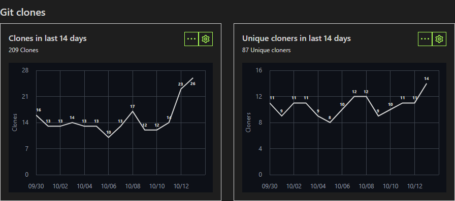

### Listen to music online using this repo's github page
all of the stream files in the root folder of this repo can be listened to using their own page on this repo and the amazing [webamp player](https://github.com/captbaritone/webamp), use the playlist buttons or click on the entries and hit play

<table>
<thead>
<tr>
<th colspan="8">genres / locations / languages</th>
</tr>
</thead>
<tbody><tr>
<td><a href="https://junguler.github.io/m3u-radio-music-playlists/stuff/60s.html">60s</a></td>
<td><a href="https://junguler.github.io/m3u-radio-music-playlists/stuff/70s.html">70s</a></td>
<td><a href="https://junguler.github.io/m3u-radio-music-playlists/stuff/80s.html">80s</a></td>
<td><a href="https://junguler.github.io/m3u-radio-music-playlists/stuff/90s.html">90s</a></td>
<td><a href="https://junguler.github.io/m3u-radio-music-playlists/stuff/acid_jazz.html">acid_jazz</a></td>
<td><a href="https://junguler.github.io/m3u-radio-music-playlists/stuff/african.html">african</a></td>
<td><a href="https://junguler.github.io/m3u-radio-music-playlists/stuff/alternative.html">alternative</a></td>
<td><a href="https://junguler.github.io/m3u-radio-music-playlists/stuff/ambient.html">ambient</a></td>
</tr>
<tr>
<td><a href="https://junguler.github.io/m3u-radio-music-playlists/stuff/americana.html">americana</a></td>
<td><a href="https://junguler.github.io/m3u-radio-music-playlists/stuff/anime.html">anime</a></td>
<td><a href="https://junguler.github.io/m3u-radio-music-playlists/stuff/arabic.html">arabic</a></td>
<td><a href="https://junguler.github.io/m3u-radio-music-playlists/stuff/asian.html">asian</a></td>
<td><a href="https://junguler.github.io/m3u-radio-music-playlists/stuff/big_band.html">big band</a></td>
<td><a href="https://junguler.github.io/m3u-radio-music-playlists/stuff/bluegrass.html">bluegrass</a></td>
<td><a href="https://junguler.github.io/m3u-radio-music-playlists/stuff/blues.html">blues</a></td>
<td><a href="https://junguler.github.io/m3u-radio-music-playlists/stuff/breakbeat.html">breakbeat</a></td>
</tr>
<tr>
<td><a href="https://junguler.github.io/m3u-radio-music-playlists/stuff/chillout.html">chillout</a></td>
<td><a href="https://junguler.github.io/m3u-radio-music-playlists/stuff/christian.html">christian</a></td>
<td><a href="https://junguler.github.io/m3u-radio-music-playlists/stuff/classical.html">classical</a></td>
<td><a href="https://junguler.github.io/m3u-radio-music-playlists/stuff/club.html">club</a></td>
<td><a href="https://junguler.github.io/m3u-radio-music-playlists/stuff/college.html">college</a></td>
<td><a href="https://junguler.github.io/m3u-radio-music-playlists/stuff/comedy.html">comedy</a></td>
<td><a href="https://junguler.github.io/m3u-radio-music-playlists/stuff/country.html">country</a></td>
<td><a href="https://junguler.github.io/m3u-radio-music-playlists/stuff/dance.html">dance</a></td>
</tr>
<tr>
<td><a href="https://junguler.github.io/m3u-radio-music-playlists/stuff/deutsch.html">deutsch</a></td>
<td><a href="https://junguler.github.io/m3u-radio-music-playlists/stuff/disco.html">disco</a></td>
<td><a href="https://junguler.github.io/m3u-radio-music-playlists/stuff/discofox.html">discofox</a></td>
<td><a href="https://junguler.github.io/m3u-radio-music-playlists/stuff/downtempo.html">downtempo</a></td>
<td><a href="https://junguler.github.io/m3u-radio-music-playlists/stuff/drum_and_bass.html">drum &amp; bass</a></td>
<td><a href="https://junguler.github.io/m3u-radio-music-playlists/stuff/easy_listening.html">easy listening</a></td>
<td><a href="https://junguler.github.io/m3u-radio-music-playlists/stuff/ebm.html">ebm</a></td>
<td><a href="https://junguler.github.io/m3u-radio-music-playlists/stuff/electronic.html">electronic</a></td>
</tr>
<tr>
<td><a href="https://junguler.github.io/m3u-radio-music-playlists/stuff/eurodance.html">eurodance</a></td>
<td><a href="https://junguler.github.io/m3u-radio-music-playlists/stuff/film.html">film</a></td>
<td><a href="https://junguler.github.io/m3u-radio-music-playlists/stuff/folk.html">folk</a></td>
<td><a href="https://junguler.github.io/m3u-radio-music-playlists/stuff/france.html">france</a></td>
<td><a href="https://junguler.github.io/m3u-radio-music-playlists/stuff/funk.html">funk</a></td>
<td><a href="https://junguler.github.io/m3u-radio-music-playlists/stuff/goa.html">goa</a></td>
<td><a href="https://junguler.github.io/m3u-radio-music-playlists/stuff/gospel.html">gospel</a></td>
<td><a href="https://junguler.github.io/m3u-radio-music-playlists/stuff/gothic.html">gothic</a></td>
</tr>
<tr>
<td><a href="https://junguler.github.io/m3u-radio-music-playlists/stuff/greek.html">greek</a></td>
<td><a href="https://junguler.github.io/m3u-radio-music-playlists/stuff/hardcore.html">hardcore</a></td>
<td><a href="https://junguler.github.io/m3u-radio-music-playlists/stuff/hardrock.html">hardrock</a></td>
<td><a href="https://junguler.github.io/m3u-radio-music-playlists/stuff/hip_hop.html">hip hop</a></td>
<td><a href="https://junguler.github.io/m3u-radio-music-playlists/stuff/house.html">house</a></td>
<td><a href="https://junguler.github.io/m3u-radio-music-playlists/stuff/india.html">india</a></td>
<td><a href="https://junguler.github.io/m3u-radio-music-playlists/stuff/indie.html">indie</a></td>
<td><a href="https://junguler.github.io/m3u-radio-music-playlists/stuff/industrial.html">industrial</a></td>
</tr>
<tr>
<td><a href="https://junguler.github.io/m3u-radio-music-playlists/stuff/instrumental.html">instrumental</a></td>
<td><a href="https://junguler.github.io/m3u-radio-music-playlists/stuff/italian.html">italian</a></td>
<td><a href="https://junguler.github.io/m3u-radio-music-playlists/stuff/jazz.html">jazz</a></td>
<td><a href="https://junguler.github.io/m3u-radio-music-playlists/stuff/jpop.html">jpop</a></td>
<td><a href="https://junguler.github.io/m3u-radio-music-playlists/stuff/jungle.html">jungle</a></td>
<td><a href="https://junguler.github.io/m3u-radio-music-playlists/stuff/latin.html">latin</a></td>
<td><a href="https://junguler.github.io/m3u-radio-music-playlists/stuff/lounge.html">lounge</a></td>
<td><a href="https://junguler.github.io/m3u-radio-music-playlists/stuff/metal.html">metal</a></td>
</tr>
<tr>
<td><a href="https://junguler.github.io/m3u-radio-music-playlists/stuff/mixed.html">mixed</a></td>
<td><a href="https://junguler.github.io/m3u-radio-music-playlists/stuff/musical.html">musical</a></td>
<td><a href="https://junguler.github.io/m3u-radio-music-playlists/stuff/oldies.html">oldies</a></td>
<td><a href="https://junguler.github.io/m3u-radio-music-playlists/stuff/opera.html">opera</a></td>
<td><a href="https://junguler.github.io/m3u-radio-music-playlists/stuff/polish.html">polish</a></td>
<td><a href="https://junguler.github.io/m3u-radio-music-playlists/stuff/polka.html">polka</a></td>
<td><a href="https://junguler.github.io/m3u-radio-music-playlists/stuff/pop.html">pop</a></td>
<td><a href="https://junguler.github.io/m3u-radio-music-playlists/stuff/portugal.html">portugal</a></td>
</tr>
<tr>
<td><a href="https://junguler.github.io/m3u-radio-music-playlists/stuff/progressive.html">progressive</a></td>
<td><a href="https://junguler.github.io/m3u-radio-music-playlists/stuff/punk.html">punk</a></td>
<td><a href="https://junguler.github.io/m3u-radio-music-playlists/stuff/quran.html">quran</a></td>
<td><a href="https://junguler.github.io/m3u-radio-music-playlists/stuff/rap.html">rap</a></td>
<td><a href="https://junguler.github.io/m3u-radio-music-playlists/stuff/reggae.html">reggae</a></td>
<td><a href="https://junguler.github.io/m3u-radio-music-playlists/stuff/retro.html">retro</a></td>
<td><a href="https://junguler.github.io/m3u-radio-music-playlists/stuff/rnb.html">rnb</a></td>
<td><a href="https://junguler.github.io/m3u-radio-music-playlists/stuff/rock.html">rock</a></td>
</tr>
<tr>
<td><a href="https://junguler.github.io/m3u-radio-music-playlists/stuff/romanian.html">romanian</a></td>
<td><a href="https://junguler.github.io/m3u-radio-music-playlists/stuff/russian.html">russian</a></td>
<td><a href="https://junguler.github.io/m3u-radio-music-playlists/stuff/salsa.html">salsa</a></td>
<td><a href="https://junguler.github.io/m3u-radio-music-playlists/stuff/schlager.html">schlager</a></td>
<td><a href="https://junguler.github.io/m3u-radio-music-playlists/stuff/ska.html">ska</a></td>
<td><a href="https://junguler.github.io/m3u-radio-music-playlists/stuff/smooth_jazz.html">smooth jazz</a></td>
<td><a href="https://junguler.github.io/m3u-radio-music-playlists/stuff/soul.html">soul</a></td>
<td><a href="https://junguler.github.io/m3u-radio-music-playlists/stuff/soundtrack.html">soundtrack</a></td>
</tr>
<tr>
<td><a href="https://junguler.github.io/m3u-radio-music-playlists/stuff/trance.html">trance</a></td>
<td><a href="https://junguler.github.io/m3u-radio-music-playlists/stuff/turk.html">turk</a></td>
<td><a href="https://junguler.github.io/m3u-radio-music-playlists/stuff/urban.html">urban</a></td>
<td><a href="https://junguler.github.io/m3u-radio-music-playlists/stuff/usa.html">usa</a></td>
<td><a href="https://junguler.github.io/m3u-radio-music-playlists/stuff/various.html">various</a></td>
<td><a href="https://junguler.github.io/m3u-radio-music-playlists/stuff/wave.html">wave</a></td>
<td><a href="https://junguler.github.io/m3u-radio-music-playlists/stuff/world.html">world</a></td>
<td></td>
</tr>
</tbody></table>

<br>

to listen to other m3u playlists in this repo click on the specific repo for each folder and listen to them from there

<table>
<thead>
<tr>
<th colspan="6">repo</th>
</tr>
</thead>
<tbody><tr>
<td><a href="https://github.com/junguler/listen_to_vtuner">vtuner</a></td>
<td><a href="https://github.com/junguler/listen_to_openradio.app">openradio.app</a></td>
<td><a href="https://github.com/junguler/listen_to_zeno.fm">zeno.fm</a></td>
<td><a href="https://github.com/junguler/listen_to_radiostationusa.fm">radiostationusa.fm</a></td>
<td><a href="https://github.com/junguler/listen_to_radioonlinelive">radioonlinelive</a></td>
<td><a href="https://github.com/junguler/listen_to_pea.fm">pea.fm</a></td>
</tr>
<tr>
<td><a href="https://github.com/junguler/listen_to_onlineradio.eu">onlineradio.eu</a></td>
<td><a href="https://github.com/junguler/listen_to_hit-tuner.net">hit-tuner.net</a></td>
<td><a href="https://github.com/junguler/listen_to_streema">streema</a></td>
<td><a href="https://github.com/junguler/listen_to_radioguide.fm">radioguide.fm</a></td>
<td><a href="https://github.com/junguler/listen_to_internetradio.com">internetradio.com</a></td>
<td><a href="https://github.com/junguler/listen_to_laut.fm">laut.fm</a></td>
</tr>
<tr>
<td><a href="https://github.com/junguler/listen_to_radio.net">radio.net</a></td>
<td><a href="https://github.com/junguler/listen_to_onlineradiobox">onlineradiobox</a></td>
<td><a href="https://github.com/junguler/listen_to_liveonlineradio">liveonlineradio</a></td>
<td><a href="https://github.com/junguler/listen_to_allradio.net">allradio.net</a></td>
<td><a href="https://github.com/junguler/listen_to_get-me_radio">get-me_radio</a></td>
<td></td>
</tr>
</tbody></table>

<br>

if you are on a chromium based web browser (chrome, vivaldi, opera, edge etc ...) you are not able to listen to the most of the streams, here is an explanation from [chrome support](https://support.google.com/chrome/thread/29505473?hl=en&msgid=29673696) which tells you why this happens and how to fix it

> Usually this error occurs because the radio station you are trying to listen to is running on an unencrypted port (not 443). This is quite common and it's not technically necessary for radio stations to be encrypted but nowadays web browsers like Chrome have started disallowing unencrypted content to be shown in an otherwise encrypted websites. There is a few solutions for you right now:

- Use a different browser like Firefox. For the moment they haven't blocked unencrypted content on an otherwise encrypted page web page.

- Open Chrome (or other chromium web browsers), go to the website and then click on the padlock icon to the left of the URL box and then from the drop down menu select the 'Site Settings' option, you can then scroll down to the 'Insecure content' option at the bottom of the page and select 'Allow', this will create an exception for the website and allow you to continue using the player as before.

- download the stream files and play them locally on your pc or other devices which i've talked about further down in this markdown file

<div>

<br>

### Shortcuts
 * [How to listen](https://github.com/junguler/m3u-radio-music-playlists#how-to-listen-to-these)
 * [How to download a stream](https://github.com/junguler/m3u-radio-music-playlists#how-to-download-a-live-stream-to-my-computer)
 * [How to save songs indivudally](https://github.com/junguler/m3u-radio-music-playlists#how-to-save-songs-indivudally-by-title-from-a-live-stream)
 * [Audio visualization](https://github.com/junguler/m3u-radio-music-playlists#mpv-only-shows-a-black-window-when-listening-to-music-how-to-make-it-pretty)
 * [Normilizing audio](https://github.com/junguler/m3u-radio-music-playlists#normilize-audio)
 * [Customize keybinds](https://github.com/junguler/m3u-radio-music-playlists#i-really-like-mpv-how-do-i-customize-keybinds)
 * [Easier m3u consumption](https://github.com/junguler/m3u-radio-music-playlists#isnt-there-an-easier-way-to-use-and-control-these-using-mpv)
 * [How to download](https://github.com/junguler/m3u-radio-music-playlists#how-to-download-all-of-the-files)
 * [Git stats](https://github.com/junguler/m3u-radio-music-playlists#git-stats)
 * [sources](https://github.com/junguler/m3u-radio-music-playlists#current-and-potential-sources)

<br>

### Extra Streams
this repo now includes a few streams made by me

`---everything-full.m3u` combines all of the streams sorted by names that are shown in this repo

`---everything-lite.m3u` is exactly like the everything-full stream but cover images and extra info was removed

`---randomized.m3u` is exactly like the everything-lite stream but every line was shuffled and randomized

`---sorted.m3u` is exactly like the everything-lite stream but the links themselves are sorted alphabetically/numerically, it's good for when you have found a good radio station with many different genres of music to listen to all of them in order

every folder in this repo excluding the `stuff` folder has these stream files unique to the content of that specific folder

there is also two newly added files that combine everything including all the folders which have a `-repo` suffix to them

<br>

### How to listen to these?
in the terminal, do this:
```
mpv https://raw.githubusercontent.com/junguler/m3u-radio-music-playlists/main/trance.m3u
```
or add/change `m3u` file association in your os to mpv and double click on any of `.m3u` files in your file manager

<br>

### how to download a live-stream to my computer?
<details>
  <summary>click me to read</summary>

<br>
  
downloading from these m3u files is not possible as far as i know since they contain multiple streams, but if you want to download from a particular stream you can achieve this by using ffmpeg, i use the most popular (first stream) in the `trance.m3u` to showcase this, in your terminal change directory to where you want this file to be at (note that lines starting with # are not actual streams and are there for embedding extra info to your media player)
```
ffmpeg -y -i http://stream.dancewave.online:8080/dance.mp3 -c copy dancewave.mp3
```
change the filename at the end to what you like, as ffmpeg suggests when you feel happy with the length/size of this file press `q` in your terminal emulator to finish the process and save the file

because these are online streams there is no way to download the whole thing as they are constantly changing, but you can set a hard limit to when recording stops using the timeout command on bash/zsh shells
```
timeout 60 ffmpeg -y -i http://stream.dancewave.online:8080/dance.mp3 -c copy dancewave.mp3
```
the above command saves about one minute of the audio live-stream, you can specify longer times using `-m` for minutes `-h` for hours and `-d` for days, these can also be used with decimals for more control, so one and half minute can be set with 1.5m or 3 hour and 45 minutes can be set with 3.75h
```
timeout 1h ffmpeg -y -i http://stream.dancewave.online:8080/dance.mp3 -c copy dancewave.mp3
```

another more elegant way to do this is to use ffmpeg to segment these files with your desired time and add a timestamp at the end as filenames, code was copied from [here](https://write.corbpie.com/ffmpeg-saving-stream-in-intervals-with-date-time-as-filename/)

```
ffmpeg -i http://stream.dancewave.online:8080/dance.mp3 -c copy -f segment -strftime 1 -segment_time 60 %Y-%m-%d-%H-%M-%S.mp3
```
this will save a new mp3 file every minute, if you want to make this longer change `-segment_time 60` and multiply the number of minutes you want for each file by 60, so if i want my mp3 files to each be 5 minutes i do `-segment_time 300`  this process goes on forever unless you run out of disk space or if you are not connected to the internet for some reason 

this command can also be stopped using `ctrl + c` shortcut or the timeout command showcased above so adding `timeout 1h` in front of the above command stops the whole process after an hour

</details>

<br>

### How to save songs indivudally by title from a live stream?

<details>
  <summary>click me to read</summary>

<br>

i have been looking for a way to do this for a while, i found this program [streamwriter](https://streamwriter.org/en/downloads/) that does this but unfortunently it's only available on windows, this [winehq page](https://appdb.winehq.org/objectManager.php?sClass=application&iId=19745) lists the program as platinum and it should work with wine without any issues but i have not tested it myself as i'm not on linux at the moment and don't have a virtual machine ready either

download the portable version of the program and extract it somewhere in your hard drive, the first time you open the program it's going to ask a few questions, things like language and where it's going to save downloaded songs, now that you are greeted with the program go to a m3u file of your favorite music genre and copy a stream link to start download, here is mine from the trance.m3u
```
http://51.89.148.171:8022/stream/1/
```
now put it inside the area i've shown and click to button next to it to start recording, after each song is completed it's going to create a new file and put a name on it from the title the stream is broadcasting


once you are happy with the amount of songs downloaded, right click on the stream and click on `stop recording after current title`

note that in some rare cases a stream does not broadcasts song titles and if you happen to come accross of these there is really nothing else you can and the program is going to continuously record the stream until you manually stop it

</details>

<br>

### Mpv only shows a black window when listening to music, how to make it pretty?
download the [visualizer](https://raw.githubusercontent.com/mfcc64/mpv-scripts/master/visualizer.lua) script for mpv and put it in your scripts folder either on `~/.config/mpv/scripts` on *nix systems 

or `C:\users\USERNAME\AppData\Roaming\mpv\scripts\` on windows

put these in your mpv.conf, this is a auto-profile for all audio files
```
[audio-only]
profile-cond=not vid
profile-restore=copy
vf-add=rgbashift=rh=-4:bv=+4
vf-add=drawbox=w=iw:h=ih:color=00FFFF@0.5
vf-add=drawbox=x=3:y=3:w=iw-6:h=ih-6:color=00FF00@0.5
vf-add=drawbox=x=6:y=6:w=iw-12:h=ih-12:color=FFFF00@0.5
vf-add=hue=H=0.1*PI*t
```

<br>

### Normilize Audio
depending on the stream some music might be too load and others too quiet, thankfully we can use an ffmpeg filter inside mpv to fix the issue and force all music to be played at the same level, put this line inside your `mpv.conf` and it will automatically normalize all audio
```
af=lavfi=[dynaudnorm=f=75:g=25:p=0.55]
```

<br>

### I really like mpv, how do i customize keybinds?
make a file called input.conf either at the folder your mpv.exe is on windows or on ~/.config/mpv/ if you are *nix systems, put these inside it for using page-up and page-down for changing radio stations
```
PGUP playlist-prev ; show-text "${playlist-pos-1}/${playlist-count}"
PGDWN playlist-next ; show-text "${playlist-pos-1}/${playlist-count}"
```

<br>

### Isn't there an easier way to use and control these using mpv?
yes there is, use the [IPTV script](https://github.com/gthreepw00d/mpv-iptv) which comes with fuzzy finding stations, better keybinds and ...

<br>

### How to download all of the files?
use the [auto-generated zip](https://github.com/junguler/m3u-radio-music-playlists/archive/refs/heads/main.zip) 

you can also run a git clone on this repo
```
git clone https://github.com/junguler/m3u-radio-music-playlists.git
```
for further updates cd into the folder and do ``git pull``

<br>

### Git Stats
since the traffic section of the insight tab is hidden to other viewers of this repo i'm going to include them and update them every two weeks so you can have feel for how this repo is doing




<br>

### Current and potential sources

here is a list of websites i've scraped from already and included m3u streams for in this repo

<table>
<thead>
<tr>
<th>website</th>
<th>folder</th>
<th>script</th>
</tr>
</thead>
<tbody><tr>
<td><a href="http://radio.pervii.com/en/online-playlists-m3u.htm">http://radio.pervii.com/en/online-playlists-m3u.htm</a></td>
<td><a href="https://github.com/junguler/m3u-radio-music-playlists">root</a></td>
<td><a href="https://github.com/junguler/m3u-radio-music-playlists/blob/main/stuff/radio.pervii.sh">radio.pervii.sh</a></td>
</tr>
<tr>
<td><a href="https://www.internet-radio.com/">https://www.internet-radio.com/</a></td>
<td><a href="https://github.com/junguler/m3u-radio-music-playlists/tree/main/internet-radio">/internet-radio</a></td>
<td><a href="https://github.com/junguler/m3u-radio-music-playlists/blob/main/stuff/internet-radio.sh">internet-radio.sh</a></td>
</tr>
<tr>
<td><a href="https://liveonlineradio.net/">https://liveonlineradio.net/</a></td>
<td><a href="https://github.com/junguler/m3u-radio-music-playlists/tree/main/live_online_radio">/live_online_radio</a></td>
<td><a href="https://github.com/junguler/m3u-radio-music-playlists/blob/main/stuff/live_online_radio.sh">live_online_radio.sh</a></td>
</tr>
<tr>
<td><a href="https://onlineradiobox.com/">https://onlineradiobox.com/</a></td>
<td><a href="https://github.com/junguler/m3u-radio-music-playlists/tree/main/online_radio_box">/online_radio_box</a></td>
<td><a href="https://github.com/junguler/m3u-radio-music-playlists/blob/main/stuff/online_radio_box.sh">online_radio_box.sh</a></td>
</tr>
<tr>
<td><a href="https://www.radio.net/">https://www.radio.net/</a></td>
<td><a href="https://github.com/junguler/m3u-radio-music-playlists/tree/main/radio.net">/radio.net</a></td>
<td><a href="https://github.com/junguler/m3u-radio-music-playlists/blob/main/stuff/radio.net.sh">radio.net.sh</a></td>
</tr>
<tr>
<td><a href="https://www.radioguide.fm/">https://www.radioguide.fm/</a></td>
<td><a href="https://github.com/junguler/m3u-radio-music-playlists/tree/main/radio_guide.fm">/radio_guide.fm</a></td>
<td><a href="https://github.com/junguler/m3u-radio-music-playlists/blob/main/stuff/radio_guide.fm.sh">radio_guide.fm.sh</a></td>
</tr>
<tr>
<td><a href="https://streema.com/">https://streema.com/</a></td>
<td><a href="https://github.com/junguler/m3u-radio-music-playlists/tree/main/streema">/streema</a></td>
<td><a href="https://github.com/junguler/m3u-radio-music-playlists/blob/main/stuff/streema.sh">streema.sh</a></td>
</tr>
<tr>
<td><a href="http://www.hit-tuner.net/">http://www.hit-tuner.net/</a></td>
<td><a href="https://github.com/junguler/m3u-radio-music-playlists/tree/main/hit_tuner.net">/hit_tuner.net</a></td>
<td><a href="https://github.com/junguler/m3u-radio-music-playlists/blob/main/stuff/hit_tuner.net.sh">hit_tuner.net.sh</a></td>
</tr>
<tr>
<td><a href="https://online-radio.eu/">https://online-radio.eu/</a></td>
<td><a href="https://github.com/junguler/m3u-radio-music-playlists/tree/main/online_radio.eu">/online_radio.eu</a></td>
<td><a href="https://github.com/junguler/m3u-radio-music-playlists/blob/main/stuff/online_radio.eu.sh">online_radio.eu.sh</a></td>
</tr>
<tr>
<td><a href="https://pea.fm">https://pea.fm</a></td>
<td><a href="https://github.com/junguler/m3u-radio-music-playlists/tree/main/pea.fm">/pea.fm</a></td>
<td><a href="https://github.com/junguler/m3u-radio-music-playlists/blob/main/stuff/pea.fm.sh">pea.fm.sh</a></td>
</tr>
<tr>
<td><a href="https://radioonlinelive.com/">https://radioonlinelive.com/</a></td>
<td><a href="https://github.com/junguler/m3u-radio-music-playlists/tree/main/radio_online_live">/radio_online_live</a></td>
<td><a href="https://github.com/junguler/m3u-radio-music-playlists/blob/main/stuff/radio_online_live.sh">radio_online_live.sh</a></td>
</tr>
<tr>
<td><a href="https://radiostationusa.fm/">https://radiostationusa.fm/</a></td>
<td><a href="https://github.com/junguler/m3u-radio-music-playlists/tree/main/radio_station_usa.fm">/radio_station_usa.fm</a></td>
<td><a href="https://github.com/junguler/m3u-radio-music-playlists/blob/main/stuff/radio_station_usa.fm.sh">radio_station_usa.fm.sh</a></td>
</tr>
<tr>
<td><a href="https://zeno.fm/">https://zeno.fm/</a></td>
<td><a href="https://github.com/junguler/m3u-radio-music-playlists/tree/main/zeno.fm">/zeno.fm</a></td>
<td><a href="https://github.com/junguler/m3u-radio-music-playlists/blob/main/stuff/zeno.fm.sh">zeno.fm.sh</a></td>
</tr>
<tr>
<td><a href="https://openradio.app">https://openradio.app</a></td>
<td><a href="https://github.com/junguler/m3u-radio-music-playlists/tree/main/openradio.app">/openradio.app</a></td>
<td><a href="https://github.com/junguler/m3u-radio-music-playlists/blob/main/stuff/openradio.app.sh">openradio.app.sh</a></td>
</tr>
<tr>
<td><a href="https://vtuner.com/setupapp/guide/asp/BrowseStations/startpage.asp">https://vtuner.com/setupapp/guide/asp/BrowseStations/startpage.asp</a></td>
<td><a href="https://github.com/junguler/m3u-radio-music-playlists/tree/main/vtuner">/vtuner</a></td>
<td><a href="https://github.com/junguler/m3u-radio-music-playlists/blob/main/stuff/vtuner.sh">vtuner.sh</a></td>
</tr>
<tr>
<td><a href="https://laut.fm/">https://laut.fm/</a></td>
<td><a href="https://github.com/junguler/m3u-radio-music-playlists/tree/main/laut.fm">/laut.fm</a></td>
<td><a href="https://github.com/junguler/m3u-radio-music-playlists/blob/main/stuff/laut.fm.sh">laut.fm.sh</a></td>
</tr>
<tr>
<td><a href="https://www.allradio.net/">https://www.allradio.net/</a></td>
<td><a href="https://github.com/junguler/m3u-radio-music-playlists/tree/main/allradio.net">/allradio.net</a></td>
<td><a href="https://github.com/junguler/m3u-radio-music-playlists/blob/main/stuff/allradio.net.sh">allradio.net.sh</a></td>
</tr>
<tr>
<td><a href="https://www.getmeradio.com/">https://www.getmeradio.com/</a></td>
<td><a href="https://github.com/junguler/m3u-radio-music-playlists/tree/main/get-me_radio">/get-me_radio</a></td>
<td><a href="https://github.com/junguler/m3u-radio-music-playlists/blob/main/stuff/get-me_radio.sh">get-me_radio.sh</a></td>
</tr>
</tbody></table>

my future plans for this repo is to keep scraping online radio websites, if and when i found one or few that are easy enough for me to scrape or not overly complicated (websites that have a cipher system to hide stream link or use services like cloadflare to avoid being easily scraped)
  
<br>
  
### websites i can't scrape
  
here is a list of websites i considered scraping but was unable to, this list will be kept updated

<table>
<thead>
<tr>
<th>website</th>
<th>reason</th>
</tr>
</thead>
<tbody><tr>
<td><a href="https://tunein.com/radio/home/">https://tunein.com/radio/home/</a></td>
<td>cloudflare protected</td>
</tr>
<tr>
<td><a href="https://www.accuradio.com/">https://www.accuradio.com/</a></td>
<td>cloudflare protected</td>
</tr>
<tr>
<td><a href="https://internetradiouk.com">https://internetradiouk.com</a></td>
<td>cloudflare protected</td>
</tr>
<tr>
<td><a href="https://www.moreradio.online/">https://www.moreradio.online/</a></td>
<td>cloudflare protected</td>
</tr>
<tr>
<td><a href="http://radio.garden/">http://radio.garden/</a></td>
<td>i don&#39;t understand this website</td>
</tr>
<tr>
<td><a href="https://www.radio-uk.co.uk/">https://www.radio-uk.co.uk/</a></td>
<td>uses a cipher system to hide stream link</td>
</tr>
<tr>
<td><a href="https://mytuner-radio.com/">https://mytuner-radio.com/</a></td>
<td>uses a cipher system to hide stream link</td>
</tr>
<tr>
<td><a href="https://www.fmradiofree.com/">https://www.fmradiofree.com/</a></td>
<td>uses a cipher system to hide stream link</td>
</tr>
<tr>
<td><a href="https://tuneyou.com/radio/music/">https://tuneyou.com/radio/music/</a></td>
<td>could not extract stream link</td>
</tr>
<tr>
<td><a href="https://live365.com/">https://live365.com/</a></td>
<td>could not get passed the first page of each genres due to js generated pages</td>
</tr>
<tr>
<td><a href="https://lixty.com/en/genres">https://lixty.com/en/genres</a></td>
<td>website was either too slow or too fast to put rate limiting restrictions on me</td>
</tr>
</tbody></table>
  
see a website you like in this list and know how to overcome the issues to scrape them? open an issue or discussion and share you knowledge with me
